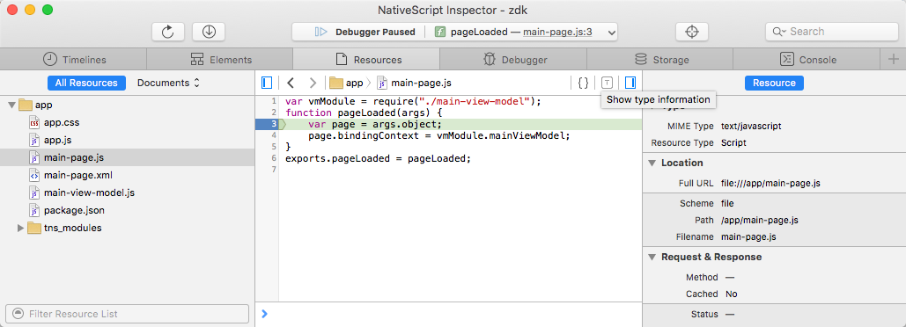

# AppInspector
AppInspector is a powerful tool that makes it easy to inspect every resource of your application. With AppInspector, you can see the Safari developer tools in a clean, unified interface, which places each of its core functions in separate tabs. For more information on how to build, deploy, run the app, and simultaneously start AppInspector, click [here](https://github.com/NativeScript/docs/blob/production/core-concepts/debugging.md).

AppInspector for iOS supports the following core functionalities:

 - **Resources** The **Resources Tab** lets you find every resource of your application folder, including documents, images, scripts, stylesheets and other resources that make up your application, in a list organized by folder structure. The Resources sidebar shows information about the selected resource. You can view the URL of the resource, as well as its MIME type. The Resource Tab has [two great tools](https://webkit.org/blog/3846/type-profiling-and-code-coverage-profiling-for-javascript/) designed to make debugging JavaScript programs easier:
     - The **Code Coverage Profiler**: Shows you exactly which parts of your program have run and which haven't.
     - The **Type Profiler**: Shows you type annotations next to important variables and function return types
     .
 - **Timelines** Timelines are a graphical representation of all JavaScript activities that occur during the lifetime of your application. You can start recording timelines in two ways: 
     - By clicking the **Start Recording** button. This shows all activities that have occurred since the record button was clicked. To stop the profile, click the record button again. 
     - By including a `console.profile()` in your script. To stop profiling, include `console.profileEnd()` in your script or evaluate it in the Console.

    Once you have captured one or more profiles, they are listed in the left side of Web Inspector. Every profiler shows the time spent in each function execution grouped in three categories: Self, Total and Average time. Where applicable, the source URL and line number of the function declaration is shown to the right of the function name. The source URL is a link. Clicking it opens the source in the content browser, scrolled to the line number where the function is declared.

 - **Debugger** If you are getting JavaScript errors on your webpage, you can use the Debugger navigation sidebar to assist you in finding the cause of the problem. By setting breakpoints throughout your code, you can inspect the values of your variables and observe the call stack during runtime. Even if your JavaScript is minified, Web Inspector pretty-prints or expands all of your scripts, allowing you to set breakpoints on minified content.

 - **Console** The console offers a way to log diagnostic information to help debug your application. 
